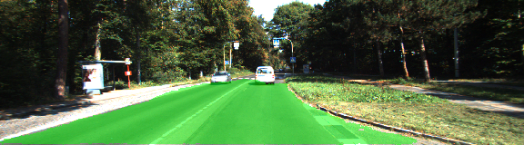
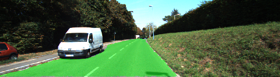
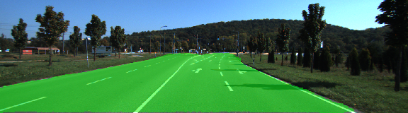
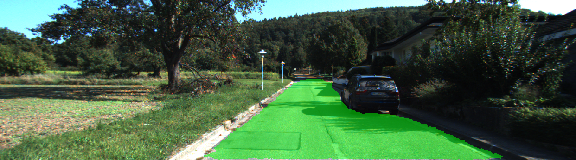
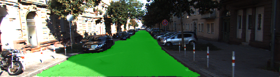

# Semantic Segmentation
### Introduction
In this project, I label the pixels of a road in images using a Fully Convolutional Network (FCN).
The project [rubric](https://review.udacity.com/#!/rubrics/989/view).

### Setup
##### Frameworks and Packages
Make sure you have the following is installed:
 - [Python 3](https://www.python.org/)
 - [TensorFlow](https://www.tensorflow.org/)
 - [NumPy](http://www.numpy.org/)
 - [SciPy](https://www.scipy.org/)
 - [Python Image Library (PIL)](https://pillow.readthedocs.io/)

##### Dataset
You can download the [Kitti Road dataset](http://www.cvlibs.net/datasets/kitti/eval_road.php) from [here](http://www.cvlibs.net/download.php?file=data_road.zip).


### Run
Run the following command to run the project:
```
python main.py
```
**Note:** If running this in Jupyter Notebook system messages, such as those regarding test status, may appear in the terminal rather than the notebook.


### Fully Convolutional Network
In this project, I use a FCN-8s, and it's made up of a encoder and a decoder. For encoder, I use a VGG16 pre-trained model, then use a 1x1 convolution to bring it to the decoder. For decoder, I use 2 special techniques, first, I use transposed convolutions to upsample the previous layer to a higher dimensions, so that the output we get is the same size as the input. Thus, it result in segmentation or the prediction of each individual pixel in the original image. The second technique is the skip connection, because the encoder will narrow down the scope by looking at some parts of the image, when we decode the output of encoder back to the original image size, some information has been lost. Skip connections are a way of retaining the information, the way skip connection work is by combining the output of the pooling layer from encoder with output of the current layer in decoder, to combine these 2 layers, we just use the element-wise addition operation.

The training date looks like:


The label data looks like:

The purple pixels are labeled as road, and the rest is labeled as non-road.


### Hyperparamers
In this porject, I use `softmax_cross_entropy_with_logits` loss function then add a L2 regularization and set keep_prob=0.6. To minimize the loss, I use the Adam optimier. Finally, I set batch_size=8 with epochs=50, the result images look like:








### Tips
- The link for the frozen `VGG16` model is hardcoded into `helper.py`.  The model can be found [here](https://s3-us-west-1.amazonaws.com/udacity-selfdrivingcar/vgg.zip).
- The model is not vanilla `VGG16`, but a fully convolutional version, which already contains the 1x1 convolutions to replace the fully connected layers. Please see this [post](https://s3-us-west-1.amazonaws.com/udacity-selfdrivingcar/forum_archive/Semantic_Segmentation_advice.pdf) for more information.  A summary of additional points, follow.
- The original FCN-8s was trained in stages. The authors later uploaded a version that was trained all at once to their GitHub repo.  The version in the GitHub repo has one important difference: The outputs of pooling layers 3 and 4 are scaled before they are fed into the 1x1 convolutions.  As a result, some students have found that the model learns much better with the scaling layers included. The model may not converge substantially faster, but may reach a higher IoU and accuracy.
- When adding l2-regularization, setting a regularizer in the arguments of the `tf.layers` is not enough. Regularization loss terms must be manually added to your loss function. otherwise regularization is not implemented.

### Why Layer 3, 4 and 7?
In `main.py`, you'll notice that layers 3, 4 and 7 of VGG16 are utilized in creating skip layers for a fully convolutional network. The reasons for this are contained in the paper [Fully Convolutional Networks for Semantic Segmentation](https://arxiv.org/pdf/1605.06211.pdf).

In section 4.3, and further under header "Skip Architectures for Segmentation" and Figure 3, they note these provided for 8x, 16x and 32x upsampling, respectively. Using each of these in their FCN-8s was the most effective architecture they found.

### Optional sections
Within `main.py`, there are a few optional sections you can also choose to implement, but are not required for the project.

1. Train and perform inference on the [Cityscapes Dataset](https://www.cityscapes-dataset.com/). Note that the `project_tests.py` is not currently set up to also unit test for this alternate dataset, and `helper.py` will also need alterations, along with changing `num_classes` and `input_shape` in `main.py`. Cityscapes is a much more extensive dataset, with segmentation of 30 different classes (compared to road vs. not road on KITTI) on either 5,000 finely annotated images or 20,000 coarsely annotated images.
2. Add image augmentation. You can use some of the augmentation techniques you may have used on Traffic Sign Classification or Behavioral Cloning, or look into additional methods for more robust training!
3. Apply the trained model to a video. This project only involves performing inference on a set of test images, but you can also try to utilize it on a full video.
